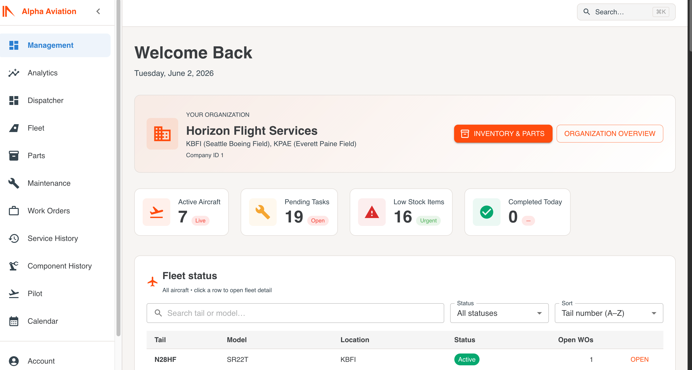

<a id="readme-top"></a>

<!-- TECH STACK -->
[](https://www.python.org/)
[](https://developer.mozilla.org/en-US/docs/Web/JavaScript)
[](https://www.djangoproject.com/)
[](https://www.django-rest-framework.org/)
[](https://www.postgresql.org/)
[](https://react.dev/)
[](https://mui.com/)
[](https://reactrouter.com/)
[](https://axios-http.com/)
[](https://jwt.io/)
[](https://python-poetry.org/)
[](https://yarnpkg.com/)
[](https://nodejs.org/)
[](https://gunicorn.org/)
[](https://www.docker.com/)
[](https://railway.app/)
[](https://whitenoise.readthedocs.io/)

<br />

<!-- PROJECT LOGO -->
<div align="center">
  <a href="https://alpha-aviation-web-production-3763.up.railway.app/">
    
  </a>

  <h3 align="center">Alpha Aviation</h3>

  <p align="center">
    Multi-tenant aviation operations — fleet, dispatch, maintenance, and platform admin in one system.
    <br />
    <br />
    <a href="https://alpha-aviation-web-production-3763.up.railway.app/"><strong>View live app »</strong></a>
    <br />
    <br />
    <a href="https://alpha-aviation-web-production-3763.up.railway.app/">View Demo</a>
    &middot;
    <a href="https://github.com/jjacobsonn/alpha-aviation/issues">Report Bug</a>
    &middot;
    <a href="https://github.com/jjacobsonn/alpha-aviation/issues">Request Feature</a>
  </p>
</div>

<br />

<!-- TABLE OF CONTENTS -->
<details>
  <summary>Table of Contents</summary>
  <ol>
    <li>
      <a href="#about-the-project">About The Project</a>
      <ul>
        <li><a href="#built-with">Built With</a></li>
      </ul>
    </li>
    <li><a href="#live-application">Live Application</a></li>
    <li><a href="#product-tour">Product Tour</a></li>
    <li><a href="#demo-credentials">Demo Credentials</a></li>
    <li>
      <a href="#getting-started">Getting Started</a>
      <ul>
        <li><a href="#prerequisites">Prerequisites</a></li>
        <li><a href="#installation">Installation</a></li>
      </ul>
    </li>
    <li><a href="#repository-structure">Repository Structure</a></li>
    <li><a href="#deployment">Deployment</a></li>
    <li><a href="#contributing">Contributing</a></li>
    <li><a href="#documentation">Documentation</a></li>
    <li><a href="#acknowledgments">Acknowledgments</a></li>
  </ol>
</details>

<br />

<!-- ABOUT THE PROJECT -->
## About The Project

<div align="center">
  <a href="https://alpha-aviation-web-production-3763.up.railway.app/management">
    
  </a>
</div>

<br />

There are many great README templates available on GitHub; however, I didn't find one that really suited my needs so I created this enhanced one. I want to create a README template so amazing that it'll be the last one you ever need -- I think this is it.

Here's why:

* Your time should be focused on creating something amazing. A project that solves a problem and helps others
* You shouldn't be doing the same tasks over and over like creating a README from scratch
* You should implement DRY principles to the rest of your life 😄

Of course, no one template will serve all projects since your needs may be different. So I'll be adding more in the near future. You may also suggest changes by forking this repo and creating a pull request or opening an issue. Thanks to all the people who have contributed to expanding this template!

Use the [documentation index](docs/README.md) to get started with architecture, RBAC, and deployment guides.

**Alpha Aviation** is a full-stack platform for flight schools and charter operators: a **Django REST API** and **React** SPA on **PostgreSQL**, with **JWT auth** and **role-based access** per company (tenant). Owners get fleet and work-order visibility; dispatchers run scheduling; pilots see assigned flights; mechanics manage discrepancies, parts, and service history; platform superusers operate cross-tenant **Site Admin**.

<p align="right">(<a href="#readme-top">back to top</a>)</p>

### Built With

This section lists the major frameworks and libraries used to bootstrap the project.

* [![React][React.js]][React-url]
* [![Django][Django.com]][Django-url]
* [![PostgreSQL][PostgreSQL.com]][PostgreSQL-url]
* [![Python][Python.org]][Python-url]
* [![Material UI][MUI.com]][MUI-url]
* [![Docker][Docker.com]][Docker-url]
* [![Railway][Railway.app]][Railway-url]

<p align="right">(<a href="#readme-top">back to top</a>)</p>

---

## Live Application

Hosted on **Railway** (personal portfolio environment).

| | URL |
|---|-----|
| **App (login)** | **[https://alpha-aviation-web-production-3763.up.railway.app/](https://alpha-aviation-web-production-3763.up.railway.app/)** |
| API | [https://alpha-aviation-api-production-03c8.up.railway.app/api/](https://alpha-aviation-api-production-03c8.up.railway.app/api/) |
| Django admin | [https://alpha-aviation-api-production-03c8.up.railway.app/admin/](https://alpha-aviation-api-production-03c8.up.railway.app/admin/) |
| Site Admin (SPA) | [https://alpha-aviation-web-production-3763.up.railway.app/site-admin](https://alpha-aviation-web-production-3763.up.railway.app/site-admin) |

<p align="right">(<a href="#readme-top">back to top</a>)</p>

---

## Product Tour

Screenshots below map to **role-based workflows**. Add PNGs under `docs/images/screenshots/` (see [capture guide](docs/images/screenshots/README.md)).

### Management & analytics — owner / manager

| | |
|---|---|
|  | **Management dashboard** — fleet availability, KPI cards with trends, open work orders by priority, drill-down to fleet and work orders. |
|  | **Analytics** (`/analytics`) — trends and operational metrics for leadership decisions. |

**Try it:** `marcus.hale` → `/management`

### Dispatch — scheduling & calendar

| | |
|---|---|
|  | **Dispatch calendar** — flight scheduling, approvals, and calendar-centric operations. |

**Try it:** `sarah.mitchell` → `/calendar` or `/dispatcher-dashboard`

### Maintenance & fleet — mechanics & operations

| | |
|---|---|
|  | **Work orders** (`/work-orders`) — status workflow, priority, parts summary, aviation maintenance tracking. |
|  | **Fleet** (`/fleet`) — aircraft registry, status, and detail views across the company. |
|  | **Maintenance** (`/maintenance`) — discrepancies and maintenance operations in one place. |

**Try it:** `mike.torres` → `/work-orders` or `/maintenance`

### Platform admin — multi-tenant

| | |
|---|---|
|  | **Site Admin** (`/site-admin`) — companies, users, and aircraft across tenants (superuser). |

**Try it:** `demo` → `/site-admin`

### Pilot portal

| | |
|---|---|
|  | **Pilot dashboard** (`/pilot-dashboard`) — assigned flights and pilot-facing tools. |

**Try it:** `james.rivera` → `/pilot-dashboard`

<p align="right">(<a href="#readme-top">back to top</a>)</p>

---

## Demo Credentials

**Default password for every account below:** `Demo2026!`

### Platform superuser (Site Admin + Django admin)

| Field | Value |
|-------|--------|
| **Username** | `demo` |
| **Password** | `Demo2026!` |
| **Access** | Superuser — all companies; not tied to one tenant |
| **SPA** | Log in at the app URL → **Site Admin** (`/site-admin`) |
| **Django** | Same credentials at `/admin/` |

**Site Admin tips**

- Companies table lists all tenants when the latest frontend is deployed.
- To work inside **Cascade Air Services** as `demo`: set tenant context  
  `localStorage.setItem('adminCompanyId', '2'); location.reload();`  
  (use `1` for Horizon).
- To see every company in the table:  
  `localStorage.removeItem('adminCompanyId'); location.reload();`

### Demo 1 — Horizon Flight Services

Locations: **KBFI** (Seattle Boeing Field), **KPAE** (Everett Paine Field). Six aircraft, full demo fleet.

| Username | Role | Good for |
|----------|------|----------|
| `marcus.hale` | Owner | Management, fleet overview |
| `sarah.mitchell` | Dispatcher | Calendar, approvals |
| `jenny.walsh` | Dispatcher | Alternate dispatch |
| `james.rivera` | Pilot | Pilot portal |
| `alex.nguyen` | Pilot | SIC / charter |
| `emily.chen` | Pilot | Training |
| `david.okonkwo` | Pilot | King Air / airline cert |
| `mike.torres` | Mechanic | Work orders, discrepancies |
| `lisa.park` | Mechanic | Inspections |
| `carlos.mendez` | Mechanic | Turbine / prop |

**Suggested walkthrough:** `marcus.hale` → `sarah.mitchell` → `mike.torres` → `demo` (Site Admin).

### Demo 2 — Cascade Air Services

Locations: **KPDX** (Portland). Second tenant for multi-company / platform-admin scenarios.

| Username | Role |
|----------|------|
| `ellen.cascade` | Owner |
| `dana.cascade` | Dispatcher |
| `nina.cascade` | Pilot |
| `owen.cascade` | Pilot |
| `rex.cascade` | Mechanic |
| `tina.cascade` | Mechanic |

Aircraft: **N55CAS** (172S), **N88CAS** (SR22T).

<p align="right">(<a href="#readme-top">back to top</a>)</p>

---

<!-- GETTING STARTED -->
## Getting Started

Local setup: [docs/setup/DEVELOPMENT.md](docs/setup/DEVELOPMENT.md).

### Prerequisites

* **Node.js** 20+
* **Python** 3.12+ with [Poetry](https://python-poetry.org/)
* **PostgreSQL** (local)
* **Yarn** (frontend)

### Installation

1. Clone the repo
   ```sh
   git clone https://github.com/jjacobsonn/alpha-aviation.git
   cd alpha-aviation
   ```
2. Install root tooling and start both apps
   ```sh
   npm install
   npm run dev
   ```
3. Backend only (from `backend/`)
   ```sh
   poetry install
   poetry run python manage.py migrate
   poetry run python manage.py runserver
   ```
4. Frontend only (from `frontend/`)
   ```sh
   yarn install
   yarn start
   ```

| App | URL |
|-----|-----|
| Backend | http://localhost:8000 |
| Frontend | http://localhost:3000 |

Set `REACT_APP_API_URL=http://localhost:8000/api` in `frontend/.env`.

<p align="right">(<a href="#readme-top">back to top</a>)</p>

---

## Repository Structure

| Folder | Description |
|--------|-------------|
| **`backend/`** | Django API, models, migrations, pytest suite |
| **`frontend/`** | React SPA, components, pages, Jest tests |
| **`docs/`** | Architecture, RBAC, deployment, handover |
| **`assets/images/`** | README logo and product screenshots |
| **`e2e/`** | Playwright smoke tests |

<p align="right">(<a href="#readme-top">back to top</a>)</p>

---

## Deployment

Production uses **Railway**: PostgreSQL, API (`Dockerfile.railway-api` / `backend/`), and web (`frontend/Dockerfile`). See [docs/deployment/RAILWAY.md](docs/deployment/RAILWAY.md).

<p align="right">(<a href="#readme-top">back to top</a>)</p>

---

<!-- CONTRIBUTING -->
## Contributing

Contributions are what make the open source community such an amazing place to learn, inspire, and create. Any contributions you make are **greatly appreciated**.

If you have a suggestion that would make this better, please fork the repo and create a pull request. You can also simply open an issue with the tag `enhancement`. Don't forget to give the project a star! Thanks again!

1. Fork the Project
2. Create your Feature Branch (`git checkout -b feature/AmazingFeature`)
3. Commit your Changes (`git commit -m 'Add some AmazingFeature'`)
4. Push to the Branch (`git push origin feature/AmazingFeature`)
5. Open a Pull Request

### Top contributors

<a href="https://github.com/jjacobsonn/alpha-aviation/graphs/contributors">
  
</a>

<p align="right">(<a href="#readme-top">back to top</a>)</p>

---

## Documentation

| Doc | Purpose |
|-----|---------|
| [docs/HANDOVER.md](docs/HANDOVER.md) | Onboarding and environment map |
| [docs/setup/DEVELOPMENT.md](docs/setup/DEVELOPMENT.md) | Local database, env vars, testing |
| [docs/README.md](docs/README.md) | Full documentation index |
| [docs/images/screenshots/README.md](docs/images/screenshots/README.md) | How to capture README screenshots |

<p align="right">(<a href="#readme-top">back to top</a>)</p>

---

<!-- ACKNOWLEDGMENTS -->
## Acknowledgments

Thank you to the lovely team who helped develop this project and bring it together — your work on fleet operations, maintenance workflows, dispatch, and platform admin made Alpha Aviation what it is.

* [Django](https://www.djangoproject.com/)
* [React](https://react.dev/)
* [Material UI](https://mui.com/)
* [Railway](https://railway.app/)
* [Best-README-Template](https://github.com/othneildrew/Best-README-Template) — README structure inspiration
* [contrib.rocks](https://contrib.rocks) — contributor avatars

<p align="right">(<a href="#readme-top">back to top</a>)</p>

---

<p align="center">Alpha Aviation — portfolio project by <a href="https://github.com/jjacobsonn">jjacobsonn</a></p>

<!-- MARKDOWN LINKS & IMAGES -->
[product-screenshot]: assets/images/ss-1.png
[React.js]: https://img.shields.io/badge/React-20232A?style=for-the-badge&logo=react&logoColor=61DAFB
[React-url]: https://react.dev/
[Django.com]: https://img.shields.io/badge/Django-092E20?style=for-the-badge&logo=django&logoColor=white
[Django-url]: https://www.djangoproject.com/
[PostgreSQL.com]: https://img.shields.io/badge/PostgreSQL-336791?style=for-the-badge&logo=postgresql&logoColor=white
[PostgreSQL-url]: https://www.postgresql.org/
[Python.org]: https://img.shields.io/badge/Python-3776AB?style=for-the-badge&logo=python&logoColor=white
[Python-url]: https://www.python.org/
[MUI.com]: https://img.shields.io/badge/MUI-007FFF?style=for-the-badge&logo=mui&logoColor=white
[MUI-url]: https://mui.com/
[Docker.com]: https://img.shields.io/badge/Docker-2496ED?style=for-the-badge&logo=docker&logoColor=white
[Docker-url]: https://www.docker.com/
[Railway.app]: https://img.shields.io/badge/Railway-0B0D0E?style=for-the-badge&logo=railway&logoColor=white
[Railway-url]: https://railway.app/
