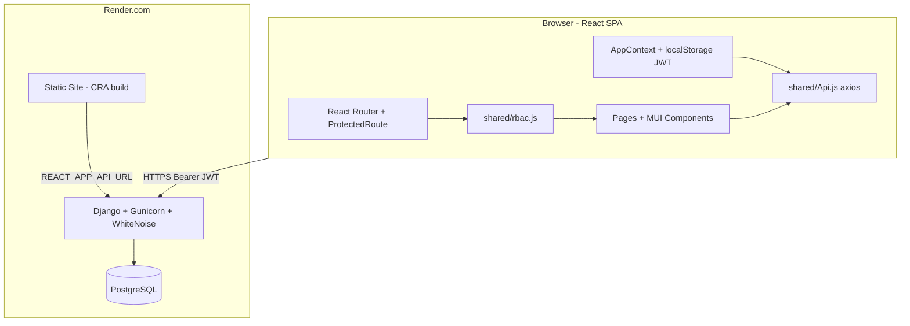

# Alpha Aviation — Codebase Audit & QA Inventory

**Generated:** May 2026  
**Scope:** Read-only inventory and pre-delivery audit (no code changes).  
**Related:** [PRODUCTION_READINESS_ROADMAP.md](./PRODUCTION_READINESS_ROADMAP.md), [RBAC_MVP_MATRIX.md](../rbac/RBAC_MVP_MATRIX.md), [PHASE2_ACCEPTANCE_CRITERIA.md](../features/PHASE2_ACCEPTANCE_CRITERIA.md)

---

## Table of contents

1. [Status legend](#status-legend)
2. [Part 0: Full project inventory](#part-0-full-project-inventory)
3. [A. System architecture overview](#a-system-architecture-overview)
4. [B. Endpoint inventory](#b-endpoint-inventory)
5. [C. User flow map](#c-user-flow-map)
6. [D. Comprehensive testing checklist](#d-comprehensive-testing-checklist)
7. [E. Risk assessment](#e-risk-assessment)
8. [Follow-up deliverables](#follow-up-deliverables)

---

## Status legend

| Status | Meaning |
|--------|---------|
| **Active** | Used in current app flow |
| **Possibly active** | Exists; conditional, admin-only, or indirect use |
| **Outdated** | Superseded, unreferenced route, or stale docs |
| **Duplicate** | Two implementations of the same concern |
| **Unknown** | Not traced to a caller; verify at runtime |

---

## Part 0: Full project inventory

### Top-level structure

| Path | Status | Notes |
|------|--------|-------|
| `/` | Active | Monorepo root (`package.json`, `README.md`, `docs/`) |
| `/backend` | Active | Django 5 + DRF API |
| `/frontend` | Active | React 19 + CRA + MUI |
| `/docs` | Active | Architecture, RBAC, deployment, Phase 2 |
| `/scripts` | Active | `test-backend.sh` smoke script |
| `/backend/src` | Outdated | Empty; README still mentions `src/` |
| `/frontend/node_modules`, `/frontend/build` | Active (local) | Dependencies / build output; not source |

### Backend inventory

#### Config & runtime

| Item | Status |
|------|--------|
| `backend/config/settings.py` | Active |
| `backend/config/settings_test.py` | Active (tests) |
| `backend/config/urls.py` | Active — `admin/`, `api/` |
| `backend/manage.py`, `backend/bin/start.sh` | Active |
| `backend/pyproject.toml`, `poetry.lock`, `requirements.txt` | Active (Poetry + Render pip path) |
| `backend/.env.example` | Active (template) |
| `backend/.env` | Unknown (gitignored; required locally) |

#### API modules

| File | Status |
|------|--------|
| `api/models.py` | Active |
| `api/views.py` | Active (**duplicate `FlightViewSet` class** — second definition wins) |
| `api/urls.py` | Active |
| `api/serializers.py` | Active |
| `api/permissions.py` | Active |
| `api/admin.py` | Active |
| `api/analytics_views.py` | Active |
| `api/component_history_views.py` | Active |
| `api/history_views.py` | Active |
| `api/labor_views.py` | Active |
| `api/search_views.py` | Active |
| `api/services.py`, `labor_utils.py`, `maintenance_activity.py` | Active (supporting) |
| `api/static/api/admin*.css/js` | Active (Django admin UX) |
| `api/migrations/*` (46 migrations) | Active |
| `api/testing/*` | Active (pytest) |

#### Management commands

| Command | Status |
|---------|--------|
| `seed.py` | Active (dev data) |
| `bootstrap_site_admins.py` | Active |
| `bootstrap_parts_and_tools.py` | Active |
| `bootstrap_component_history.py` | Active |
| `bootstrap_labor_entries.py` | Active |
| `ensure_inventory_lines.py` | Possibly active (ops) |

#### Data / assets

| Item | Status |
|------|--------|
| `backend/parts_list.csv` | Possibly active (seed/bootstrap) |
| `backend/work_order_components/`, `work_order_signatures/` | Possibly active (sample media) |

### Frontend inventory

#### Pages (`frontend/src/pages/`)

| Page | Route(s) | Status |
|------|----------|--------|
| `Login.js` | `/`, `/login` | Active |
| `ChangePasswordPage.js` | `/change-password` | Active |
| `Management.js` | `/management` | Active |
| `AnalyticsPage.js` | `/analytics` | Active |
| `AdminCompanies.js` | `/admin/companies` | Active |
| `AdminCompanyForm.js` | `/admin/companies/new` | Active |
| `CompanyOverview.js` | `/admin/companies/current` | Active |
| `FleetPage.js` | `/fleet` | Active |
| `FleetDetailPage.js` | `/fleet/:id` | Active |
| `PartsPage.js` | `/parts` (+ `?tab=tools`) | Active |
| `ToolsPage.js` | `/tools` | Outdated — redirects to `/parts?tab=tools` |
| `Maintenance.js` | `/maintenance` | Active |
| `WorkOrders.js` | `/work-orders` | Active |
| `ServiceHistoryPage.js` | `/service-history` | Active |
| `ComponentHistoryPage.js` | `/component-history` | Active |
| `PilotDashboard.js` | `/pilot-dashboard` | Active |
| `DispatcherDashboard.js` | `/dispatcher-dashboard` | Active |
| `DispatchCalendarPage.js` | `/calendar`, `/dispatch-calendar` | Active (duplicate routes) |
| `SiteAdminPortal.js` | `/site-admin` | Active |
| `AccountPage.js` | `/account` | Active |
| `NotFound.js` | `*` | Active |

#### Components (selected)

| Component | Status | Notes |
|-----------|--------|-------|
| `Layout.js`, `NavigationDrawer.js`, `ProtectedRoute.js` | Active | Shell + RBAC gate |
| `LandingPage.js` | Outdated | Imported in `App.js` but **no route**; tests only |
| `components/FleetStatusPanel.js` | Outdated | Superseded by `management/FleetStatusPanel.js`; tests skipped |
| `components/management/FleetStatusPanel.js` | Active | Used on Management |
| `components/management/FleetAvailabilityPanel.js` | Active | Phase 2 dashboard |
| `AddWorkOrderForm.js`, `AddDiscrepancyForm.js` | Active | Shared forms |
| `parts/ToolsCalibrationPanel.js` | Active | Parts → Calibration tab |
| `search/*` | Active | Global search |
| `analytics/*` | Active | Analytics page |
| `calendar/*` | Active | Dispatch calendar |
| `history/WorkOrderHistoryViewer.js` | Active | Service history detail |
| `maintenance/LaborEntriesPanel.js` | Active | Labor on WO close |

#### Shared / context

| File | Status |
|------|--------|
| `shared/Api.js` | Active — central HTTP client |
| `shared/rbac.js` | Active — route/menu matrix |
| `shared/moduleSearch.js`, `searchNavigation.js` | Active |
| `context/AppContext.js` | Active — auth + user + view-as |

#### Tests

| Area | Status |
|------|--------|
| `frontend/src/tests/**` | Active but **narrow coverage** (many modules untested) |
| `backend/api/testing/test_views.py` | Active (~79 test references) |

### Frontend routes

| Path | Roles (frontend) | Status |
|------|------------------|--------|
| `/`, `/login` | Public | Active |
| `/change-password` | Any authenticated + `mustChangePassword` | Active |
| `/management` | owner, manager | Active |
| `/analytics` | owner, manager | Active |
| `/admin/companies*` | manager | Active |
| `/fleet`, `/fleet/:id` | per `MODULE_ALLOWED_ROLES` | Active |
| `/parts` | owner, manager, mechanic | Active |
| `/tools` | same — redirect only | Possibly active (legacy URL) |
| `/maintenance`, `/work-orders` | ops roles | Active |
| `/service-history` | owner, manager, dispatcher, mechanic | Active |
| `/component-history` | owner, manager, mechanic | Active |
| `/pilot-dashboard` | incl. pilot | Active |
| `/dispatcher-dashboard` | owner, manager, dispatcher | Active |
| `/calendar`, `/dispatch-calendar` | Duplicate → same page | Active |
| `/site-admin` | platform admin | Active |
| `/account` | any authenticated | Active |
| `*` → NotFound | — | Active |

**Not routed:** `LandingPage` (marketing UI exists only in tests).

### API surface (summary)

- **Base:** `/api/` (JWT Bearer; optional `X-Company-Id` for staff)
- **Django admin:** `/admin/`
- **Health:** `GET /api/health/` (public)

See [B. Endpoint inventory](#b-endpoint-inventory) for full list.

### Database models (tables)

| Model | Status |
|-------|--------|
| `Company` | Active |
| `Profile` (custom user) | Active |
| `Pilot`, `Mechanic` | Active (role extensions) |
| `Aircraft` | Active |
| `Part`, `Inventory`, `InventoryPart` | Active |
| `InstalledComponent`, `ComponentEvent` | Active |
| `Flight` | Active |
| `WorkOrder`, `WorkOrderPart`, `LaborEntry` | Active |
| `Discrepancy` | Active |
| `WorkOrderActivity`, `DiscrepancyActivity` | Active |
| `Tool`, `CalibrationRecord` | Active |
| `AircraftPhoto`, `AircraftMaintenanceInterval` | Active |

**Roles (`Profile.company_role`):** `owner`, `manager`, `mechanic`, `dispatcher`, `pilot` (+ platform `is_staff` / `is_superuser`).

### Forms & dialogs (UI)

| Form / surface | Page(s) | Status |
|----------------|---------|--------|
| Login (username/password) | Login | Active |
| Change password | ChangePasswordPage | Active |
| Company create/edit | AdminCompanyForm, SiteAdminPortal | Active |
| Work order create/edit/close/sign-off | Maintenance, WorkOrders, SiteAdminPortal | Active |
| Discrepancy report/edit | Maintenance, PilotDashboard, SiteAdminPortal | Active |
| Flight request / dispatch | PilotDashboard, DispatcherDashboard, SiteAdminPortal | Active |
| Calendar event modal | DispatchCalendarPage | Active |
| Parts / inventory CRUD | PartsPage | Active |
| Tool calibration | PartsPage (ToolsCalibrationPanel) | Active |
| Fleet intervals | FleetDetailPage | Active |
| Component registration / history | ComponentHistoryPage | Active |
| Service history archive edit | ServiceHistoryPage, WorkOrderHistoryViewer | Active |
| Account profile PATCH | AccountPage | Active |
| Labor entries | LaborEntriesPanel | Active |
| Global search | SiteSearchDialog | Active |

### Authentication flows

| Flow | Mechanism | Status |
|------|-----------|--------|
| Login | `POST /api/auth/login/` → JWT in `localStorage` | Active |
| Session restore | `GET /api/users/me/` on app load | Active |
| Token refresh | Axios interceptor → `POST /api/auth/token/refresh/` | Active |
| Logout | `POST /api/auth/logout/` + clear storage | Active (**blacklist risk** — see [E](#e-risk-assessment)) |
| Force password change | `must_change_password` → `/change-password` | Active |
| Admin reset password | `POST /api/profiles/:id/reset-password/` | Active (manager/owner) |
| Platform tenant switch | `localStorage.adminCompanyId` → `X-Company-Id` | Active |
| View-as role (UI testing) | `localStorage.viewAsUser` | Possibly active |

### External integrations

| Service | Status |
|---------|--------|
| **PostgreSQL** | Active (local `DB_*` or Render `DATABASE_URL`) |
| **Render.com** | Active (documented prod: API + static frontend) |
| **JWT (simplejwt)** | Active |
| **WhiteNoise** | Active (static on backend) |
| **Django file fields** (profiles, signatures) | Active — **no S3/CDN configured in settings** |
| Email, payments, analytics SaaS | **None in codebase** |

### Environment variables

| Variable | Where | Required | Status |
|----------|-------|----------|--------|
| `SECRET_KEY` | backend | Yes (prod) | Active |
| `DEBUG` | backend | Yes | Active |
| `ALLOWED_HOSTS` | backend | Prod | Active |
| `CORS_ALLOWED_ORIGINS` | backend | Prod | Active |
| `DATABASE_URL` **or** `DB_NAME`, `DB_USER`, `DB_PASSWORD`, `DB_HOST`, `DB_PORT` | backend | Yes | Active |
| `REACT_APP_API_URL` | frontend build | Yes | Active |
| `frontend/.env` | local | Active (gitignored; **do not commit**) |

### Docs & scripts

| Doc / script | Status |
|--------------|--------|
| `docs/setup/DEVELOPMENT.md` | Active |
| `docs/deployment/DEPLOYMENT.md` | Active |
| `docs/rbac/*` | Active (some gaps noted in matrix) |
| `docs/operations/PRODUCTION_READINESS_ROADMAP.md` | Active (checklist) |
| `docs/architecture/APIContract.md` | Possibly active (may drift from code) |
| `docs/testing/*` | Active (QA reports, suite overviews) |
| `docs/features/PHASE2_ACCEPTANCE_CRITERIA.md` | Active (23/24 criteria met) |
| `scripts/test-backend.sh` | Active (manual smoke) |
| Root `npm run dev` | Active |

### Directory tree (source only)

```
alpha-aviation/
├── backend/
│   ├── api/
│   │   ├── management/commands/
│   │   ├── migrations/
│   │   ├── static/api/
│   │   └── testing/
│   ├── bin/
│   ├── config/
│   ├── src/                    # empty — outdated README reference
│   ├── work_order_components/
│   └── work_order_signatures/
├── docs/
│   ├── architecture/
│   ├── deployment/
│   ├── features/
│   ├── operations/             # this file
│   ├── rbac/
│   ├── reference/
│   ├── setup/
│   ├── testing/                # test reports and suite docs
│   ├── HANDOVER.md
│   └── README.md
├── frontend/
│   ├── public/
│   └── src/
│       ├── components/
│       ├── context/
│       ├── pages/
│       ├── shared/
│       └── tests/
└── scripts/
```

---

## A. System architecture overview



### Stack

| Layer | Technology |
|-------|------------|
| API | Django 5.2, DRF, SimpleJWT, PostgreSQL, CORS, WhiteNoise |
| Web | React 19, Create React App, MUI 7, React Router 7, Axios |
| Hosting | Render (Postgres + Python web + static SPA) |

### Tenancy

Most data is scoped by `Profile.company`. Platform admins (`is_staff` / `is_superuser`) impersonate tenants via:

- Header: `X-Company-Id`
- Frontend: `localStorage.adminCompanyId` (set from Site Admin / company picker)

### Auth model

- Stateless JWT: 15-minute access, 7-day refresh, rotation enabled
- Tokens stored in `localStorage` (XSS tradeoff documented in [PRODUCTION_READINESS_ROADMAP.md](./PRODUCTION_READINESS_ROADMAP.md))
- Default DRF permission: `IsAuthenticated`

### Deployment topology

Three Render services:

1. PostgreSQL
2. Python web — `/api/`, `/admin/`, migrations on start
3. Static site — CRA `build/`, rewrite `/*` → `/index.html`

See [DEPLOYMENT.md](../deployment/DEPLOYMENT.md).

---

## B. Endpoint inventory

**Prefix:** `/api/` unless noted.

### Auth & user

| Method | Path | Auth | Frontend caller | Status |
|--------|------|------|-----------------|--------|
| GET | `health/` | Public | — | Active |
| POST | `auth/login/` | Public | `loginUser` | Active |
| POST | `auth/token/refresh/` | Public | Axios interceptor | Active |
| POST | `auth/logout/` | JWT | `logoutUser` | Active |
| GET/PATCH | `users/me/` | JWT | `fetchCurrentUser`, `patchCurrentUser` | Active |
| POST | `users/me/change-password/` | JWT | `changeOwnPassword` | Active |
| POST | `profiles/:id/reset-password/` | Manager/owner | `adminResetPassword` | Active |

### Company-scoped aggregates (function views)

| Method | Path | Typical roles | Frontend caller | Status |
|--------|------|---------------|-----------------|--------|
| GET | `company/users/` | Member | PilotDashboard, etc. | Active |
| GET | `company/aircrafts/` | Member | Many pages | Active |
| GET | `company/flights/` | Member | Calendar, dashboards | Active |
| POST | `company/flights/request/` | Pilot flow | `createCompanyFlightRequest` | Active |
| PATCH | `company/flights/:id/dispatch/` | Dispatcher | `patchCompanyFlightDispatch` | Active |
| GET | `company/workorders/` | Member | Maintenance, Management, WO | Active |
| GET | `company/discrepancies/` | Member | Maintenance, Pilot, etc. | Active |
| GET | `company/inventories/` | Member | — | Possibly active (superseded by `detailed/`) |
| GET | `company/inventories/detailed/` | Mechanic+ | PartsPage | Active |
| GET | `company/inventories/detailed/low-stock/` | Mechanic+ | PartsPage | Active |
| GET | `company/tools/` | Mechanic+ | — | Possibly active (duplicate of `/tools/`) |
| GET | `company/role/` | — | — | Outdated (no frontend usage found) |

### Dashboards & analytics

| Method | Path | Roles | Frontend | Status |
|--------|------|-------|----------|--------|
| GET | `management/dashboard/` | Manager/owner | Management | Active |
| GET | `dashboard/fleet-availability/` | Manager/owner | FleetAvailabilityPanel | Active |
| GET | `maintenance/dashboard/` | Mechanic+ | Maintenance | Active |
| GET | `analytics/maintenance/` | Manager/owner | AnalyticsPage | Active |
| GET | `analytics/fleet-performance/` | Manager/owner | AnalyticsPage | Active |
| GET | `search/?q=` | Member | SiteSearchDialog | Active |

### Fleet module

| Method | Path | Frontend | Status |
|--------|------|----------|--------|
| GET | `fleet/aircraft/` | FleetPage | Active |
| GET | `fleet/aircraft/:id/` | FleetDetailPage | Active |
| GET/POST | `fleet/aircraft/:id/intervals/` | FleetDetailPage | Active |
| PATCH/DELETE | `fleet/intervals/:id/` | FleetDetailPage | Active |
| POST | `fleet/intervals/:id/complete/` | FleetDetailPage | Active |

### History

| Method | Path | Frontend | Status |
|--------|------|----------|--------|
| GET | `history/work-orders/` | ServiceHistoryPage | Active |
| GET | `history/work-orders/:id/` | WorkOrderHistoryViewer | Active |
| GET/POST | `history/components/` | ComponentHistoryPage | Active |
| GET | `history/components/:id/` | ComponentHistoryPage | Active |
| GET | `history/components/:id/export/` | CSV download | Active |

### Labor

| Method | Path | Frontend | Status |
|--------|------|----------|--------|
| GET/POST | `workorders/:pk/labor-entries/` | LaborEntriesPanel | Active |
| PATCH/DELETE | `workorders/:pk/labor-entries/:entry_pk/` | LaborEntriesPanel | Active |

### ViewSets (DRF router — standard CRUD unless noted)

| Resource | Base path | Custom actions | Primary frontend | Status |
|----------|-----------|----------------|------------------|--------|
| companies | `/companies/` | — | SiteAdminPortal, Admin* | Active |
| profiles | `/profiles/` | — | SiteAdminPortal, Management | Active |
| aircraft | `/aircraft/` | `GET :id/work_order_history/` | SiteAdminPortal CRUD | Action unused in FE |
| parts | `/parts/` | — | Parts, Maintenance, WO | Active |
| discrepancies | `/discrepancies/` | `POST :id/open_work_order/` | Maintenance | Active |
| workorders | `/workorders/` | `POST :id/close/` | Maintenance, WO, History | Active |
| flights | `/flights/` | — | SiteAdminPortal; company/* elsewhere | Active |
| inventories | `/inventories/` | — | Parts, SiteAdminPortal | Active |
| tools | `/tools/` | `record_calibration`, `calibration_history` | ToolsCalibrationPanel | Active |

Standard viewset verbs per resource: `GET` list, `POST` create, `GET :id`, `PUT/PATCH :id`, `DELETE :id` (subject to permission classes in `api/views.py` and `api/permissions.py`).

### Possibly unused / legacy API paths

| Path | Status |
|------|--------|
| `GET aircraft/availability/` | Possibly active (no FE reference) |
| `GET flights/calendar/` | Possibly active (FE uses `company/flights/`) |
| `GET company/inventories/` (non-detailed) | Outdated vs `detailed/` |
| `GET company/role/` | Outdated |
| `GET company/tools/` | Duplicate of `/tools/` |
| First `FlightViewSet` in `views.py` (~line 1369) | Duplicate/dead code (overwritten by second class) |

### Quick counts

- **Public routes:** 2 (`/`, `/login`)
- **Protected route patterns:** 20 (including `/calendar` + `/dispatch-calendar`, legacy `/tools`)
- **API:** ~15 function views + 9 viewsets + custom actions + labor/history/search/analytics

---

## C. User flow map

```mermaid
flowchart TD
  Start([Open app]) --> Login{JWT in localStorage?}
  Login -->|No| LoginPage[/login]
  Login -->|Yes| Me[GET /users/me/]
  Me --> MustPW{must_change_password?}
  MustPW -->|Yes| ChgPW[/change-password]
  MustPW -->|No| RoleRoute{company_role / is_staff}

  RoleRoute -->|staff/superuser| SiteAdmin[/site-admin]
  RoleRoute -->|owner/manager| Mgmt[/management]
  RoleRoute -->|mechanic| Maint[/maintenance]
  RoleRoute -->|pilot| Pilot[/pilot-dashboard]
  RoleRoute -->|dispatcher| Disp[/dispatcher-dashboard]

  Mgmt --> Nav[Sidebar modules]
  Nav --> Fleet[/fleet]
  Nav --> Parts[/parts]
  Nav --> WO[/work-orders]
  Nav --> Maint
  Nav --> Analytics[/analytics]
  Nav --> AdminCo[/admin/companies]

  Pilot --> ReqFlight[Request flight]
  Pilot --> ReportDisc[Report discrepancy]
  Pilot --> CalView[Calendar read-only context]

  Disp --> DispatchFlights[Dispatch / approve flights]
  Disp --> Cal[/calendar]
  Disp --> WO

  Maint --> DiscWO[Discrepancy → open WO]
  Maint --> CloseWO[Close / sign WO + labor]

  SiteAdmin --> PickCo[Set adminCompanyId]
  PickCo --> CRUD[Cross-tenant CRUD all viewsets]

  Nav --> Account[/account]
  Account --> Logout[POST logout + clear tokens]
```

### Role → default landing

| Role | Default route |
|------|----------------|
| Platform admin | `/site-admin` |
| owner, manager | `/management` |
| mechanic | `/maintenance` |
| pilot | `/pilot-dashboard` |
| dispatcher | `/dispatcher-dashboard` |
| Unknown role | `/login` (error on login) |

Source: `frontend/src/shared/rbac.js` → `getDefaultRouteForUser`.

### Navigation gaps to verify manually

- **Pilot** should not see Fleet/Parts/Maintenance in sidebar (RBAC), but may deep-link — API should return 403.
- **Mechanic** has no Dispatcher dashboard in menu; has Calendar.
- **`/tools`** redirects to Parts — bookmark compatibility only.
- Unauthorized route → redirects to **`/login`** (not role home) — UX risk.

### API usage patterns (frontend)

| Operation | List source | Mutations |
|-----------|-------------|-----------|
| Work orders | `GET /company/workorders/` | `POST/PATCH/DELETE /workorders/`, `POST /workorders/:id/close/` |
| Discrepancies | `GET /company/discrepancies/` | `POST/PATCH/DELETE /discrepancies/` |
| Flights (ops UI) | `GET /company/flights/` | Request/dispatch endpoints; Site Admin uses `/flights/` viewset |
| Inventory | `GET /company/inventories/detailed/` | `POST/PATCH/DELETE /inventories/` |

---

## D. Comprehensive testing checklist

Use for project closeout; mark **Pass / Fail / Blocked** per environment (local + Render).

### Authentication

- [ ] Login valid/invalid credentials; error messages
- [ ] Token refresh on 401; concurrent tab refresh
- [ ] Logout clears tokens and blocks protected routes
- [ ] Expired refresh forces re-login
- [ ] `must_change_password` blocks app until changed
- [ ] Change password validation (mismatch, weak password)

### Authorization / RBAC

- [ ] Each role: sidebar shows only allowed modules
- [ ] Direct URL to forbidden module → blocked (FE + API 403)
- [ ] Owner-only delete WO/discrepancy; manager cannot delete
- [ ] Pilot edit own discrepancy only; cannot edit others'
- [ ] Mechanic sign-off only with `inspector_authentication`
- [ ] Platform admin + `X-Company-Id` sees correct tenant data
- [ ] View-as role changes UI permissions without breaking API (staff bypass)

### CRUD by domain

- [ ] **Companies** (manager + site admin)
- [ ] **Profiles** create/edit; admin password reset
- [ ] **Aircraft** CRUD; fleet status fields
- [ ] **Flights** request (pilot) → dispatch (dispatcher) → calendar display
- [ ] **Discrepancies** create → open WO → close with WO
- [ ] **Work orders** create, assign, status transitions, close, delete (owner)
- [ ] **Parts/inventory** CRUD, low-stock alerts, delete line
- [ ] **Tools** calibration record + history
- [ ] **Fleet intervals** create, complete, delete (owner)
- [ ] **Component history** register, timeline, CSV export
- [ ] **Service history** search; dispatcher read; supervisor edit

### Forms & validation

- [ ] Required fields on all create dialogs
- [ ] Date/time ordering (flight departure/arrival)
- [ ] Numeric fields (tach, labor hours, ATA code)
- [ ] Employee ID uniqueness per company
- [ ] Server validation errors surfaced in UI

### API contract

- [ ] List endpoints return arrays or `{results}` — FE normalizes correctly
- [ ] PATCH partial updates persist
- [ ] 401/403/404/500 handled with user-visible message
- [ ] CORS preflight with `X-Company-Id` on non-auth paths

### UI states

- [ ] Loading spinners on slow pages (Management, Maintenance, Fleet)
- [ ] Empty states (no aircraft, no WOs, no search results)
- [ ] Error banners / retry
- [ ] Mobile: sidebar collapse, tables scroll
- [ ] Basic a11y: modal focus, form labels

### Security

- [ ] `DEBUG=False` on production API
- [ ] `ALLOWED_HOSTS` / `CORS_ALLOWED_ORIGINS` match deployed URLs
- [ ] No secrets in frontend bundle (only `REACT_APP_API_URL`)
- [ ] JWT not logged to console in prod build
- [ ] Staff `X-Company-Id` scoped correctly

### Regression hotspots (from code review)

- [ ] Logout blacklist does not 500
- [ ] Duplicate calendar routes behave identically
- [ ] Component history: mechanic yes, dispatcher no (FE + BE)
- [ ] Service history: dispatcher read, pilot blocked
- [ ] Site admin without `adminCompanyId` — clear empty/error state

### Automated tests (existing)

```bash
# Backend
cd backend && poetry run python manage.py test

# Frontend
cd frontend && yarn test --watchAll=false

# API smoke (backend must be running)
./scripts/test-backend.sh http://localhost:8000/api
```

---

## E. Risk assessment

### Critical

| Issue | Impact | Location / notes |
|-------|--------|------------------|
| JWT blacklist without `token_blacklist` app | `logout()` calls `token.blacklist()` — likely **500 on logout** or broken rotation (`BLACKLIST_AFTER_ROTATION: True`) | `backend/config/settings.py`, `api/views.py` logout |
| Tokens in `localStorage` | XSS → account takeover | `frontend/src/shared/Api.js` |
| No `MEDIA_ROOT` / cloud storage | Uploads may not persist on Render ephemeral disk | Django file fields on Profile, signatures |

### High

| Issue | Impact |
|-------|--------|
| Duplicate `FlightViewSet` in `views.py` | Dead code; maintenance hazard |
| FE RBAC vs BE RBAC drift | Deep-link / API may allow more than UI suggests |
| Unauthorized users sent to `/login` | Looks like session loss |
| `Profile.role_choices` lists `dispatcher` twice | Admin/data quirk |
| Platform admin without `adminCompanyId` | Wrong or empty tenant data |

### Medium

| Issue | Impact |
|-------|--------|
| `LandingPage` + root `FleetStatusPanel` dead code | Misleading tests |
| Legacy API endpoints unused by FE | Doc/contract drift |
| `/calendar` vs `/dispatch-calendar` duplicate | Bookmark confusion if one removed |
| `APIContract.md` may be stale | Wrong manual test expectations |
| Limited frontend E2E coverage | Regressions in Site Admin, Fleet, Component History |
| `frontend/.env` modified in working tree | Secret commit risk |

### Low

| Issue | Impact |
|-------|--------|
| MDV-004 dashboard drag-and-drop deferred | Known Phase 2 gap |
| `ToolsPage` redirect only | Harmless |
| Empty `backend/src` | README confusion |
| Skipped `FleetStatusPanel.test.js` | False confidence |

### Production readiness confidence (read-only estimate)

| Area | Confidence |
|------|------------|
| Core ops (WO, discrepancies, flights) | Medium–High |
| Phase 2 (analytics, search, fleet dashboard) | Medium |
| Auth/session hardening | Low–Medium |
| Media / file uploads | Low |
| **Overall** | **~65–70%** — functional MVP on Render; **block closeout on logout/blacklist and media persistence** |

---

## Follow-up deliverables

Not yet written as separate docs; recommended next files:

| Deliverable | Description |
|-------------|-------------|
| **FINAL_QA_REPORT.md** | Prioritized issues + recommended fixes |
| **MANUAL_CLOSEOUT_TEST_PLAN.md** | Hour-by-hour runbook for delivery day (personas, credentials, per-page checks) |

---

## Document maintenance

When adding routes, endpoints, or roles:

1. Update this file and [RBAC_MVP_MATRIX.md](../rbac/RBAC_MVP_MATRIX.md).
2. Cross-check [APIContract.md](../architecture/APIContract.md) or mark contract sections stale.
3. Re-run `./scripts/test-backend.sh` and backend `manage.py test` before release.
